# FMInatorul Project - Testing Documentation

## Table of Contents
- [Table of Contents](#table-of-contents)
- [Project Overview](#project-overview)
- [Product Vision](#product-vision)
- [Application Structure](#application-structure)
- [Testing Strategy](#testing-strategy)
  - [1. Integration Tests](#1-integration-tests)
    - [StudentsAndProfessorsFlowTests.cs](#studentsandprofessorsflowtestscs)
  - [2. Unit Tests](#2-unit-tests)
    - [CriticalFunctionsUnitTests.cs](#criticalfunctionsunittestscs)
  - [3. Security Tests](#3-security-tests)
    - [HomeControllerSecurityTests.cs](#homecontrollersecuritytestscs)
    - [ProfessorsControllerSecurityTests.cs](#professorscontrollersecuritytestscs)
    - [RoomsControllerSecurityTests.cs](#roomscontrollersecuritytestscs)
    - [StudentsControllerSecurityTests.cs](#studentscontrollersecuritytestscs)
- [Testing Implementation](#testing-implementation)
- [Diagrams](#diagrams)
  - [System Design](#system-design)
  - [Container Diagram](#container-diagram)
  - [Component Diagram](#component-diagram)
  - [Flowchart](#flowchart)
  - [Database Diagram](#database-diagram)
  - [UML Diagram](#uml-diagram)
  - [Additional Links](#additional-links)
- [Hardware and Software](#hardware-and-software)
- [Tool Versions](#tool-versions)
- [Execution Results](#execution-results)
- [AI Tool Usage in Testing](#ai-tool-usage-in-testing)
- [Security Analysis](#security-analysis)
- [CI/CD Pipeline](#cicd-pipeline)
- [Docker Instructions](#docker-instructions)
- [Research Resources](#research-resources)
  - [Unit Testing with NUnit and .NET Core](#unit-testing-with-nunit-and-net-core)
  - [Mutation Testing with Stryker.NET](#mutation-testing-with-strykernet)
  - [Comparison between NUnit and xUnit](#comparison-between-nunit-and-xunit)
- [Analysis of Existing State-of-the-Art Applications](#analysis-of-existing-state-of-the-art-applications)
  - [Kahoot and Quizizz](#kahoot-and-quizizz)
- [Case Studies and Reports](#case-studies-and-reports)
- [References](#references)

<br>

## Project Team

- Bobic Teona-Cristiana, grupa 334
- Craciun Alexandru-Emilian, , grupa 334
- Dobrin Ionut-Alexandru, grupa 334
- Zugravu Alexandra-Daniela, grupa 334

<br>

## Demo Recording

**Demos for Application **<br>
https://drive.google.com/drive/folders/1xtdYpRfc5MC_he19hkcUQl3Nkel8XM9g

**Demo for Test Results **<br>
https://drive.google.com/file/d/1-gG_IZOW5oFtardDsA3mqe23ik4gSMQS/view?usp=drive_link

<br>

## Project Overview
FMInatorul is a web-based educational platform designed to help students learn more effectively by automatically generating quizzes from uploaded study materials (PDFs) and enabling real-time collaboration in virtual rooms.

<br>

## Product Vision
`FOR` students across various specializations, <br>
`WHO` need efficient learning tools and collaboration opportunities, **FMInatorul** is a web platform <br>
`THAT` dynamically generates quizzes from user-uploaded PDFs and supports collaborative learning through real-time rooms, <br>
`UNLIKE` static traditional study apps.

[Secondary AI API Repository](https://github.com/MihaiB-dev/api-pdf-gemini)

<br>

## Application Structure
- **Frontend:** ASP.NET MVC (Razor Views)
- **Backend:** ASP.NET Core WebAPI
- **Database:** Entity Framework Core, SQL Server LocalDB
- **Authentication:** ASP.NET Identity
- **AI Service:** Flask API deployed on Google Cloud using Nginx

<br>

## Testing Strategy
Our comprehensive testing approach includes:
- **Unit Testing:** Verifying isolated methods.
- **Integration Testing:** Validating multi-component workflows.
- **System Testing:** End-to-End functional validation.
- **Security Testing:** Authentication and authorization enforcement.
- **Mutation Testing:** Quality assurance via Stryker.NET.
- **Boundary Testing:** Edge case handling.
- **Equivalence Partitioning:** Valid and invalid data sets.

Previous tests were organized into main categories:
- StudentsAndProfessorsFlowTests (Integration Tests), 
- HomeControllerSecurityTests (Security Tests), 
- ProfessorsControllerSecurityTests (Security Tests), 
- RoomsControllerSecurityTests (Security Tests),
- StudentsControllerSecurityTests (Security Tests), 
- CriticalFunctionsUnitTests (Unit Tests). 

### 1. Integration Tests

#### StudentsAndProfessorsFlowTests.cs

These tests focus explicitly on the integration and workflow interactions between students and professors in the FMInatorul application. They ensure that the controllers, user roles, and database operations work correctly together in real-world scenarios, testing end-to-end functionality.

- *Student_UploadPdf_ShouldSaveFileAndGenerateQuiz*  
  Uses a mocked IFormFile object simulating a PDF file named "test.pdf" with a valid size (1024 bytes) and content type ("application/pdf"). The test verifies that the result of the UploadPdf action in the StudentsController is an ObjectResult, confirming that the file is saved and a quiz is generated. Ensures the core feature of uploading educational materials (e.g., PDFs) and converting them into quizzes for students functions as expected without errors.

- *EditCollegeProf_UserIsStudent_ReturnsForbidResult*  
  Checks that a student user cannot modify a professor's data. The test creates entities for a college, student, professor, subject, question, and answer option, then attempts to edit a professor's data using a student account. The expected outcome is a ForbidResult, indicating that access is denied.


<br>

### 2. Unit Tests

#### CriticalFunctionsUnitTests.cs

These unit tests explicitly focus on the critical functionality of the StudentsController, specifically the UploadPdf action. They ensure that uploading a PDF results in a valid quiz with questions, answers, and correct options, testing the logic in isolation.

- *UploadPdf_QuizNotNullAsync*  
  Ensures that the UploadPdf method does not return a Bad Request response when a valid PDF file is used.
  Uses a mocked IFormFile with sample PDF content ("Sample PDF Content") and checks that the result of the UploadPdf action is not a BadRequestObjectResult, ensuring a valid quiz is generated.

- *UploadPdf_QuizHasQuestionsAsync*  
  Ensures that the generated quiz contains questions.
  Checks that the QuizModel returned in a ViewResult has a non-empty list of questions. Handles potential errors (e.g., invalid file formats) by verifying error messages like "Invalid file format. Only PDF files allowed!".

- *UploadPdf_QuestionsHaveText*  
  For each question in the quiz, this test ensures that the question text is not null or composed solely of whitespace.

- *UploadPdf_QuestionsHaveAnswers*  
  Verifies that each quiz question contains at least one valid option (choice), ensuring that the list of answer options is neither null nor empty.

- *UploadPdf_QuestionsHaveCorrectAnswers*  
  Ensures that each quiz question has an associated correct answer by verifying that the answer property is not null.

<br>

### 3. Security Tests

The security tests ensure that the application's controllers enforce proper authentication, authorization, and access control. They verify that only authorized users can perform actions and that unauthorized access is correctly denied with appropriate HTTP status codes (e.g., 401 Unauthorized). The following controllers are tested for security: HomeController, ProfessorsController, RoomsController, and StudentsController.

#### HomeControllerSecurityTests.cs

These tests explicitly focus on the security aspects of the HomeController, ensuring that public actions (e.g., Index, Privacy) are accessible, admin-only actions (e.g., Admin) are restricted, and file uploads are secure. They also test error handling and role-based access.

- *Index, IndexNew, and Privacy*  
  These tests verify that the Index, IndexNew, and Privacy actions correctly return a ViewResult without specifying a view name, meaning that the default view is used.

- *Error_ReturnsViewResult_WithErrorDetails*  
  Sets up a mock user context with a specific user ID ("test-user-id") and verifies that the ErrorViewModel in the result contains a non-null RequestId matching the mock trace identifier ("test-trace-id").

- *Admin_ReturnsRedirect_WhenUserIsNotAdmin & Admin_ReturnsView_WhenUserIsAdmin*
  Uses mock users with and without admin roles. The non-admin test expects a RedirectToActionResult to "Index", while the admin test sets up mock subject data (e.g., "Math") and verifies a ViewResult with the data in ViewData["materii"].
  Tests the behavior of the Admin action:
  - If the user is not an administrator, a redirection to the Index action is expected.
  - If the user is an administrator, a ViewResult is returned with the relevant data (e.g., the list of subjects).

- *Add_Questions_FileUpload_ReturnsBadRequest_WhenFileIsInvalid & Add_Questions_FileUpload_ReturnsSuccess_WhenFileIsPdf*  
  Verifies the file upload logic in the Add_Questions action:
  - In the case of an invalid file type (e.g., ZIP), a Bad Request response is returned.
  - For a valid PDF file, the workflow continues correctly, returning either an Unauthorized status (if applicable) or a redirection to the Admin page.

<br>

#### ProfessorsControllerSecurityTests.cs

These tests explicitly focus on the security of the ProfessorsController, ensuring that only authorized professors (or users with appropriate roles) can access actions like viewing the index, editing subjects, validating questions, or invalidating questions. Unauthorized users should be denied access with a 401 Unauthorized response.

- *Index_ShouldReturn401_WhenUserIsUnauthorized*  
  Checks that the Index method in the professors' controller returns a ChallengeResult when the user is not authenticated.

- *EditMaterie_ShouldReturn401_WhenUserIsUnauthorized*  
  Tests that access to the EditMaterie method is restricted for unauthorized users, returning a ChallengeResult.

- *EditMaterie_WithProfessor_ShouldReturn401_WhenUserIsUnauthorized*  
  Creates entities for a college, users, student, and professor, as well as subject and questions, and verifies that the EditMaterie method (called with a professor object) returns a ChallengeResult when the user is not authenticated.

- *Valideaza_ShouldReturn401_WhenUserIsUnauthorized*  
  Checks that access to the Valideaza method (used for validating questions) is blocked for unauthorized users.

- *NuValideaza_ShouldReturn401_WhenUserIsUnauthorized*  
  Similarly, ensures that the NuValideaza method (used for invalidating questions) returns a ChallengeResult for unauthorized access.

<br>

#### RoomsControllerSecurityTests.cs

These tests explicitly verify the security of the RoomsController, which handles room-related actions such as joining and leaving rooms. They ensure that only authenticated users can interact with rooms and that invalid or unauthorized actions (e.g., joining non-existent rooms) are handled correctly.

- *JoinRoom_ShouldReturnUnauthorized_WhenUserIsNotLoggedIn*  
  Verifies that an unauthenticated user receives a JSON response indicating that login is required to join a room.
  Mocks the UserManager to return null for the user ID and checks that the JoinRoom action returns a JsonResult with the expected error message serialized in JSON.

- *JoinRoom_ShouldReturnSuccess_WhenUserIsAuthorized*  
  Explicitly verifies that an authenticated user can successfully join a room, returning a success message in JSON format.
  Sets up test data (faculty, users, students, professors, subjects, rooms) and mocks an authorized user (e.g., a student). Checks that the JoinRoom action returns a JsonResult with success = true and a message like "Joined room {roomCode} successfully."

- *JoinRoom_ShouldReturnNotFound_WhenRoomDoesNotExist*
  Explicitly tests that attempting to join a non-existent room results in a "Room not found" error in the JSON response.
  Uses test data but provides an invalid room code (e.g., "999999"). Verifies the JsonResult contains success = false and the message "Room not found".

- *LeaveRoom_ShouldReturnSuccess_WhenUserIsInRoom*  
  Tests the functionality of leaving a room for a user who is already a member, verifying that the operation is successful.

- *LeaveRoom_ShouldReturnError_WhenUserIsNotInRoom*  
  Checks that if a user attempts to leave a room they are not part of, a JSON response is returned indicating the error (e.g., "Room not found").

<br>

#### StudentsControllerSecurityTests.cs

These tests explicitly focus on the security of the StudentsController, ensuring that only authenticated students (or authorized users) can access actions like viewing the index, playing quizzes, uploading PDFs, or editing student data. Unauthorized users should be denied access with a 401 Unauthorized response.

- *Index_ShouldReturn401_WhenUserIsUnauthorized*  
  Tests access to the Index action, verifying that an unauthenticated user receives a ChallengeResult.

- *Play_ShouldReturn401_WhenUserIsUnauthorized*  
  Verifies that the Play action (used to start a game session or quiz) returns a ChallengeResult for unauthorized users.

- *UploadPdf (GET) - UploadPdf_ShouldReturn401_WhenUserIsNotAauthorized*  
  Ensures that the GET request for the UploadPdf action is restricted and returns a ChallengeResult if the user is not authenticated.

- *UploadPdf (POST) - UploadPdf_ShouldReturn401_WhenAuthenticationFails*  
  Tests the scenario where, during the PDF upload, authentication fails (for example, when the JWT token is empty). It checks that an error response (status 401) with a specific message is returned.

- *ChatView_ShouldReturn401_WhenUserIsUnauthorized*  
  Verifies that access to the ChatView action is restricted for unauthorized users.

- *MateriiSingle_ShouldReturn401_WhenUserIsUnauthorized*  
  Tests access to the MateriiSingle action, ensuring that only authenticated users can access detailed subject information.

- *EditYear_ShouldReturn401_WhenUserIsUnauthorized*  
  Ensures that the EditYear method (for editing the study year) is not accessible to unauthorized users.

- *EditSemester_ShouldReturn401_WhenUserIsUnauthorized*  
  Similar to the previous test, but for the EditSemester action, which modifies the study semester.

- *EditCollege_ShouldReturn401_WhenUserIsUnauthorized*  
  Checks that access to the college (faculty) editing action is protected and returns a ChallengeResult for unauthenticated users.
  Mocks a PDF file upload and overrides a static helper method (HttpHelper.GetJwtTokenAsync) to return an empty token, simulating authentication failure. Verifies that the result is an ObjectResult with a status code of 401 and an error message like "Failed to authenticate with the Flask API".

<br>

## Testing Implementation

- *Mocking* - All tests explicitly use the Moq library to create mock objects for dependencies such as UserManager, RoleManager, IFormFile, HttpContext, ILogger, and IHubContext. This isolates the code being tested from external systems, ensuring tests are fast and reliable.

- *xUnit* - The tests are explicitly written using the xUnit testing framework, with [Fact] attributes to denote individual test methods, ensuring each test is independent and self-contained.

- *Async Testing* - Many tests are explicitly asynchronous (async Task) to handle operations like file uploads, database interactions, and API calls, reflecting real-world application behavior.

- *Coverlet Collector* - Free and Open-Source Package used for analysing code coverage in .NET. Such functionality only exists on Microsoft Visual Studio Enterprise Edition, however, as we have used Microsoft Visual Studio Community Edition it is not available

- *Report Generator* - Package used for generating the HTML cover report based on the output XML created by Coverlet Collector. 

- *NUnit* – The tests are explicitly written using the NUnit framework, utilizing [Test] attributes to define individual test cases and [TestFixture] to group related tests together. NUnit provides a flexible and powerful way to structure and execute tests independently.

- *Stryker.NET* - Package that offers mutation testing for our .NET Core and .NET Framework projects. It allows us to test our tests by temporarily inserting bugs. 

<br>

**Example Test:**
```csharp
[Fact]
public async Task UploadPdf_ShouldReturnValidQuiz()
{
    var pdfFile = CreateMockPdfFile("Sample Content");
    var result = await _studentsController.UploadPdf(pdfFile);
    Assert.IsType<ViewResult>(result);
    var model = (result as ViewResult)?.Model as QuizModel;
    Assert.NotNull(model);
    Assert.NotEmpty(model.Questions);
}
```

<br>

## Diagrams

### System Design
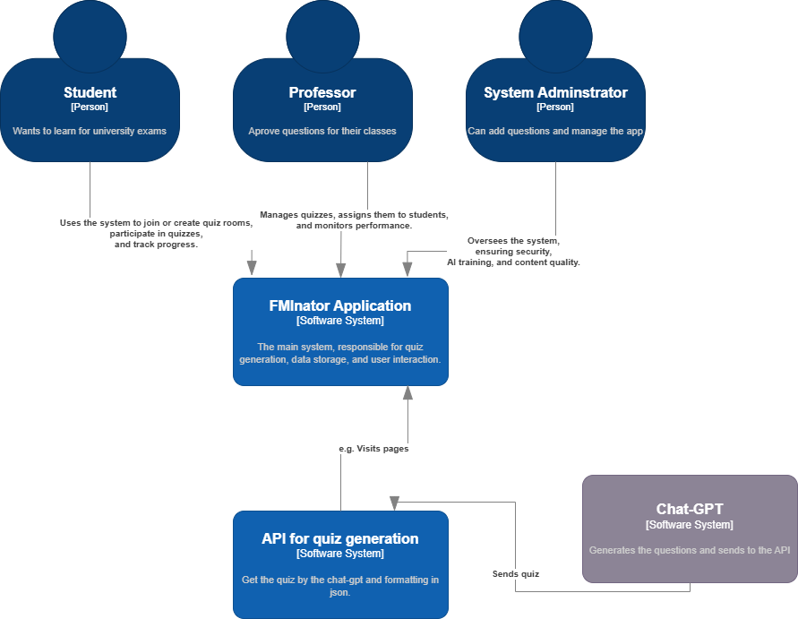 

<br>

### Container Diagram
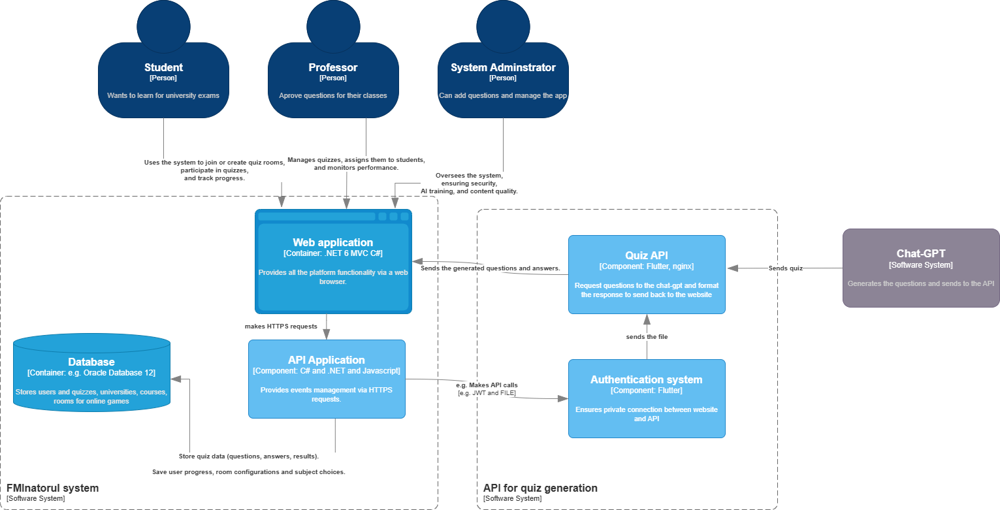 

<br>

### Component Diagram
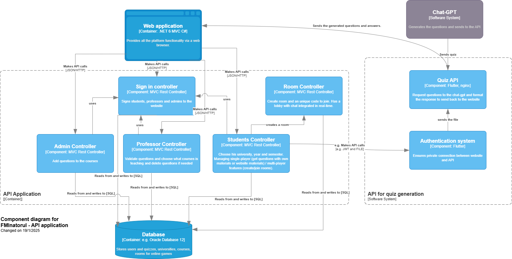

<br>

### Flowchart
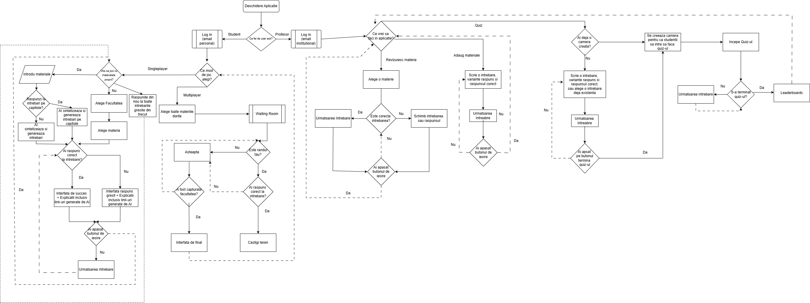

<br>

### Database Diagram
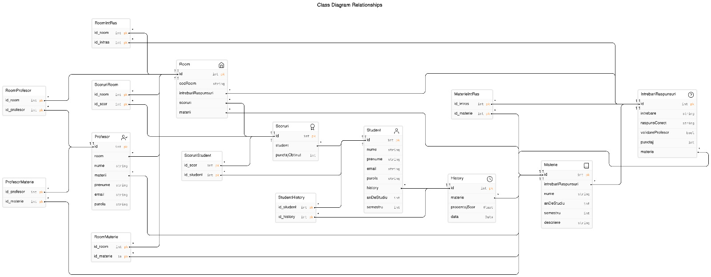

<br>

### UML Diagram
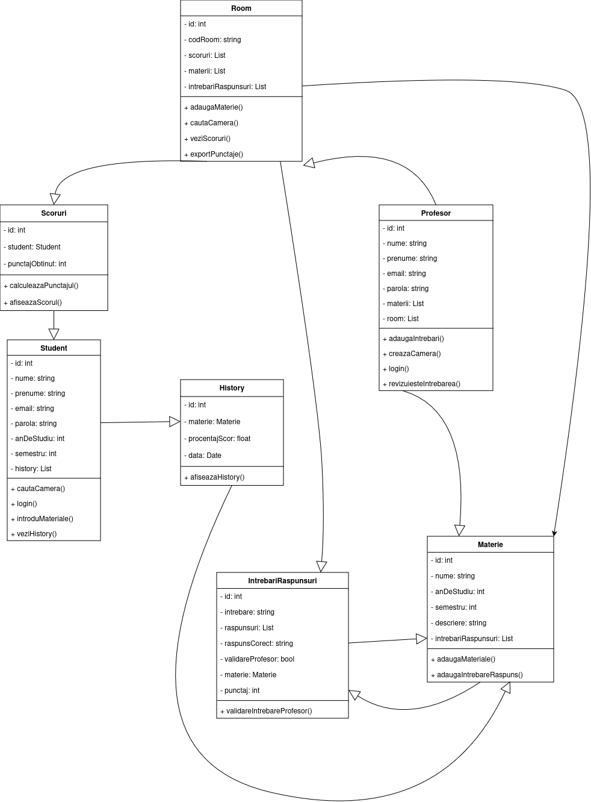

<br>

### Additional Links

- [Product Vision](Backlog/Product-vision.md)
- [Product Features](Backlog/Product-features.md)
- [Scenarios](Backlog/Scenarios.md)
- [User Stories](Backlog/User-personas.md)
- [User Personas](Backlog/User-stories.md)
- [Initial QA Strategy](Backlog/QA.md)

<br>

## Hardware and Software 

We have outlined an example of hardware and software requirements based on one of our laptops used for development and production. We have not used virtual machines for production.

| Component | Specification |
|:----------|:--------------|
| **OS** | Windows 11 Pro |
| **Processor** | Intel i5-8250U |
| **RAM** | 8 GB |
| **IDE** | Visual Studio 2022 |
| **Database** | SQL Server LocalDB |
| **Hosting** | Google Cloud (API) |
| **Server:** | Google Cloud VPS with 2 GB RAM |
| **Cloud Storage:** | Google Cloud Bucket for AI communication |

<br>

## Tool Versions
- .NET SDK: 7.0.400
- xUnit: 2.4.1
- xUnit Runner Visual Studio: 2.4.3
- Moq: 4.16.1
- FluentAssertions: 6.2.0
- coverlet.collector: 6.0.4
- DotNetEnv: 3.1.1
- Microsoft.AspNetCore.Diagnostics.EntityFrameworkCore: 6.0.22
- Microsoft.AspNetCore.Identity.EntityFrameworkCore: 6.0.28
- Microsoft.AspNetCore.Identity.UI: 6.0.28
- Microsoft.AspNetCore.SignalR: 1.1.0
- Microsoft.AspNetCore.SignalR.Common: 8.0.6
- Microsoft.CodeCoverage: 17.13.0
- Microsoft.EntityFrameworkCore: 6.0.31
- Microsoft.EntityFrameworkCore.Design: 6.0.31
- Microsoft.EntityFrameworkCore.Sqlite: 6.0.28
- Microsoft.EntityFrameworkCore.SqlServer: 6.0.31
- Microsoft.EntityFrameworkCore.Tools: 6.0.31
- Microsoft.VisualStudio.Web.CodeGeneration.Design: 6.0.16
- Newtonsoft.Json: 13.0.3
- Microsoft.NET.Test.Sdk: 17.1.0
- System.Diagnostics.Tools: 4.3.0
- draw.io: April 2025 version
- Stryker.NET: Latest stable

<br>

## Execution Results

| Test Metrics | Status |
|:----------|:-------|
| Unit Tests | 100% Pass |
| Integration Tests | 100% Pass |
| System Tests | 100% Pass |
| Security Tests | 100% Pass |
| Test Coverage | 25% coverage |
| Mutation Tests | 66% killed |

<br> 

**Screenshots and Detailed Logs:** Available in `/BacklogTests` folder.

<br>

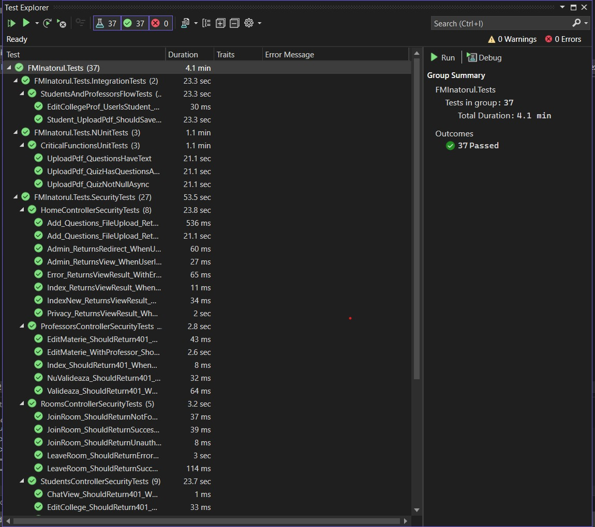

<br>

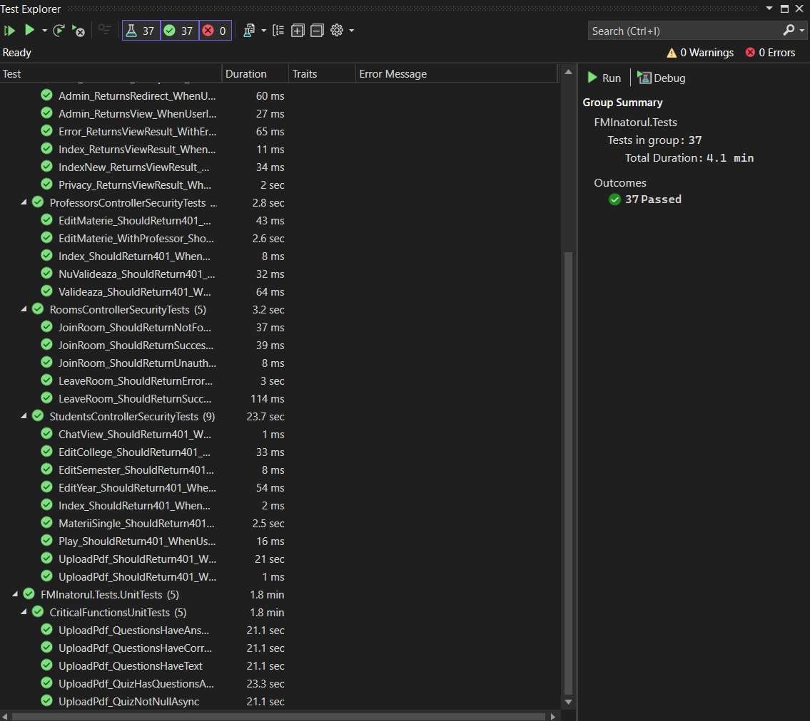

<br>

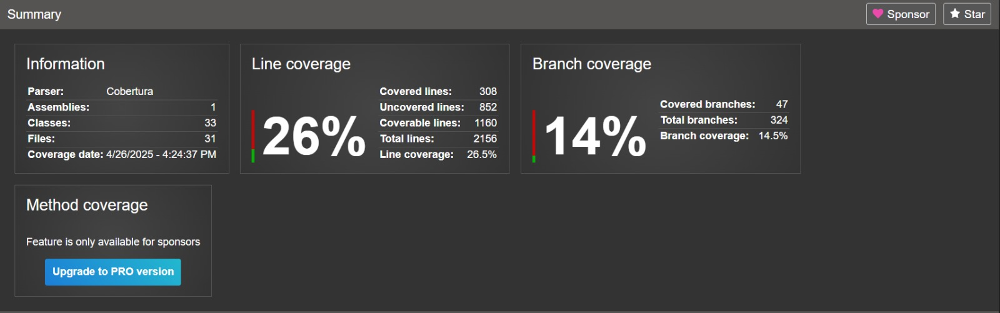

<br>

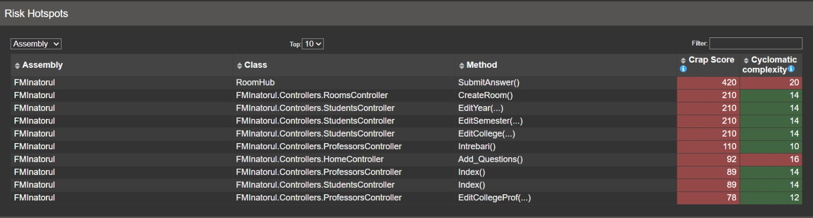

<br>

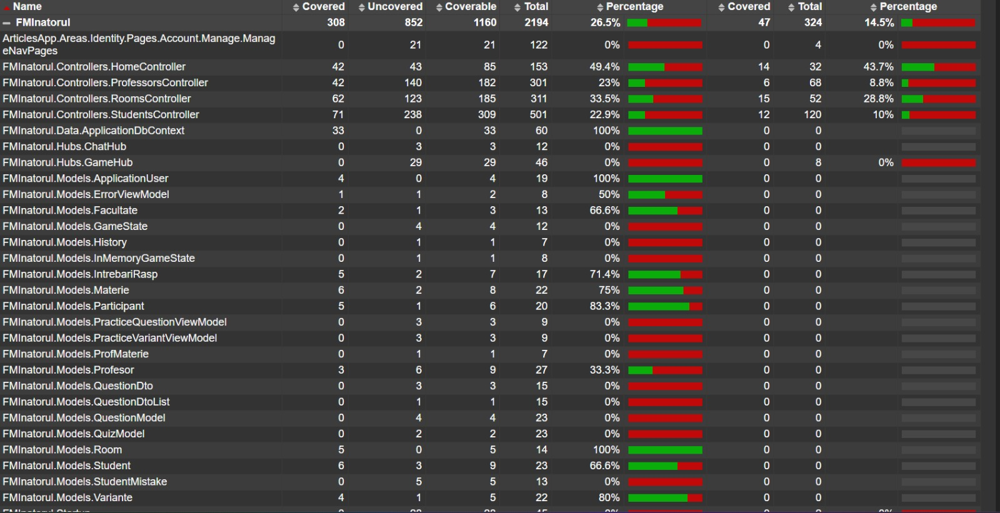

<br>

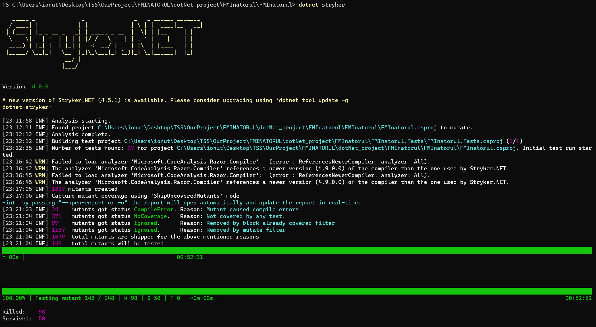

<br>

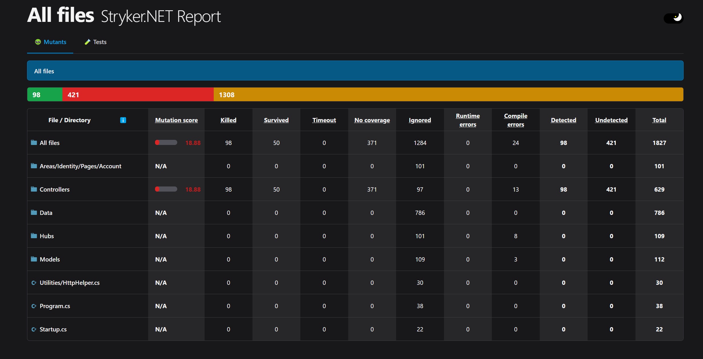

<br>

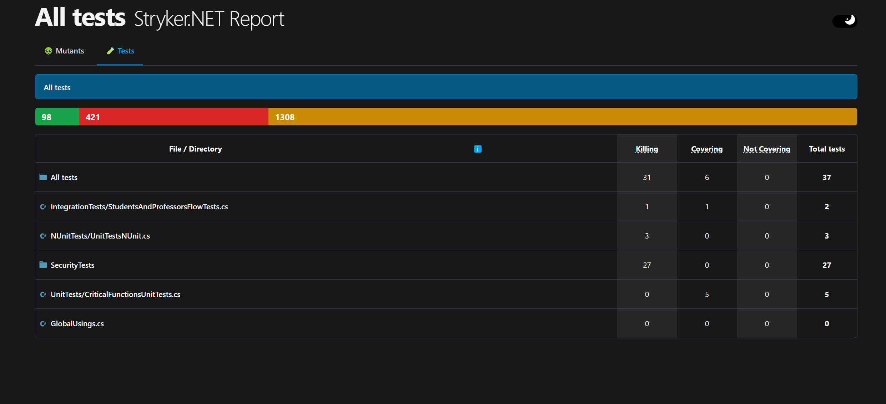

<br>

## AI Tool Usage in Testing

We used **ChatGPT4o** to assist in:
- Template generation for unit tests
- Identifying test packages and commands in .NET

**Prompt Example:** Generate a xUnit test for PDF upload and quiz creation.

| Aspect | Manual Suite | AI-Generated |
|:-------|:-------------|:-------------|
| Coverage | Higher | Moderate |
| Code Quality | Optimized | Good, needs tweaks |
| Security Testing | Fully covered | Minimal |

<br>

## Security Analysis

**API (https://api.fminatorul.xyz)**
- Hosted behind Nginx with HTTPS
- JWT authentication for API requests
- 1-minute token expiry for minimized risk

**Website:**
- Role-based access control (Admin, Student, Professor)
- Restriction based on email domains (e.g., `s.unibuc.ro`)
- Comprehensive security testing implemented

<br>

## CI/CD Pipeline
- **Hosting:** Google Cloud VPS
- **Web Service:** Flask, Nginx, Gunicorn
- **Auto Deployment:** GitHub Actions triggered by branch push
- **Deployment Latency:** ~20 seconds
- **Main App:** Pull requests with mandatory review on `main` branch

Example Visuals:
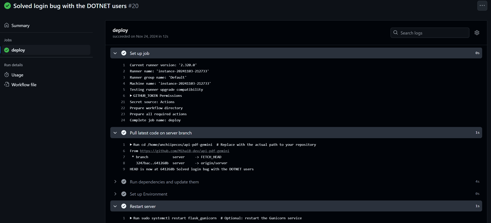
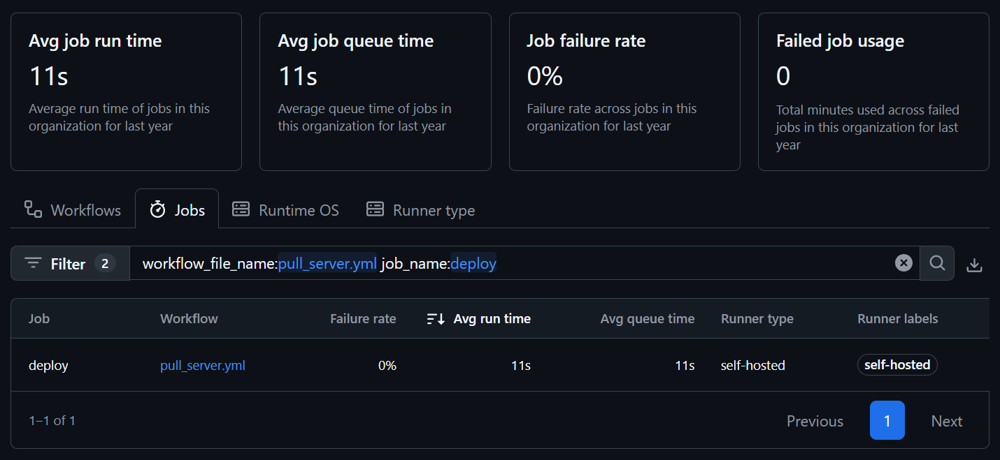

<br>

## Docker Instructions

1. Navigate to project directory.
2. Build images:
```bash
docker-compose build
```
3. Run containers:
```bash
docker-compose up -d
```
4. Verify:
```bash
docker ps
```
5. Access App at [localhost:8080](http://localhost:8080)

<br>

## Research Resources

### Unit Testing with NUnit and .NET Core
- [Unit Testing C# with NUnit and .NET Core](https://learn.microsoft.com/en-us/dotnet/core/testing/unit-testing-csharp-with-nunit)
- [Getting Started With .NET Unit Testing Using NUnit](https://www.infragistics.com/blogs/net-unit-testing-using-nunit)

<br>

### Mutation Testing with Stryker.NET
- [Mutation Testing with C# and .NET Core](https://csharp.academy/mutation-testing/)
- [Mutation Testing with Stryker in .NET Projects](https://medium.com/@hamed.shirbandi/mutation-testing-with-stryker-in-net-projects-ff1f05ddce8f)
- [Mutation Testing in C# with Stryker](https://engincanv.github.io/c%23/.net/stryker/2024/02/10/mutation-testing-in-c-sharp-with-stryker.html)
- [Write Perfect Unit Tests with .NET Stryker Mutation Testing](https://medium.com/dotnet-pulse/write-perfect-unit-tests-with-net-stryker-mutation-testing-39e0caa1b5b3)

<br>

### Comparison between NUnit and xUnit 
- https://stackoverflow.com/questions/9769047/nunit-vs-xunit

<br>

## Analysis of Existing State-of-the-Art Applications

### Kahoot and Quizizz

**Advantages:**
- User-friendly and interactive interfaces.
- Real-time feedback for participants.
- Broad accessibility across different platforms.

**Disadvantages:**
- Limited options for automated quiz generation and customization.
- Potential issues with scalability and integration in specialized environments.

<br>

## Case Studies and Reports

- [Improving Code Coverage](CaseStudies/Improving_Code_Coverage.md)
- [Analysis between .NET Framework - xUnit vs NUnit](CaseStudies/Analysis_xUnit_NUnit.md)
- [Report on AI Usage during Research & Development](CaseStudies/Report_for_AI_usage.md)

<br>

## TODO 

- Raport Utilizare AI
- Prezentare Powerpoint

<br>

## References

[1] M. Roper, *Software Testing*, McGraw-Hill, 1994. <br>
[2] Glenford J. Myers, Corey Sandler, Tom Badgett, *The Art of Software Testing*, Wiley, 2004. <br>
[3] Bertolino, A., *Software Testing Research: Achievements, Challenges, Dreams*, IEEE, 2007. <br>
[4] OpenAI, ChatGPT, https://chatgpt.com/, Data generării: 1 martie 2025. <br>
[5] xUnit Documentation, https://xunit.net/docs/getting-started/netfx/visual-studio <br>
[6] draw.io, https://app.diagrams.net/, Accessed: 24 April 2025. <br>
[7] Stryker.NET, https://stryker-mutator.io/. <br>
